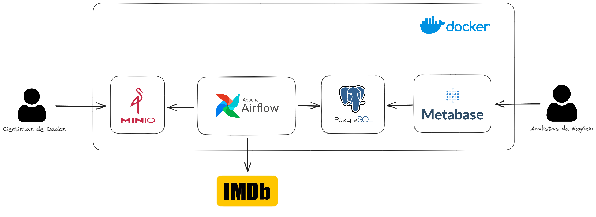
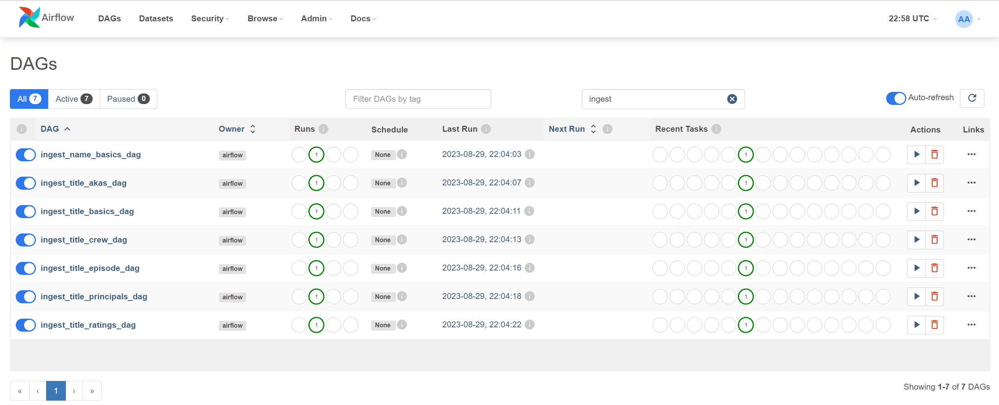
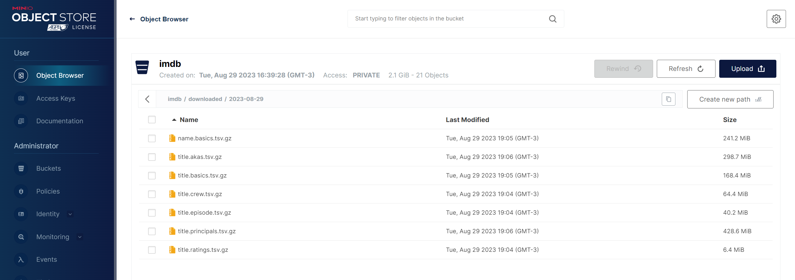
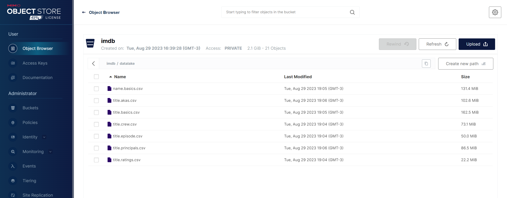
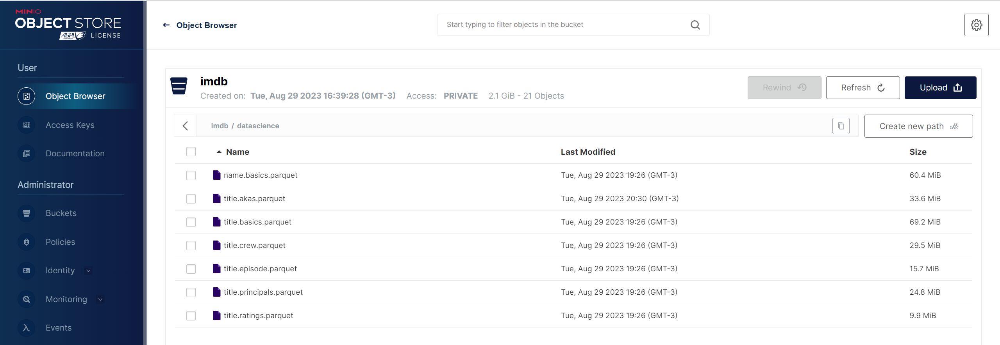
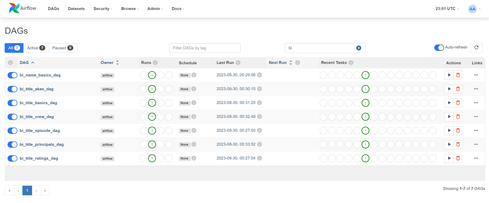
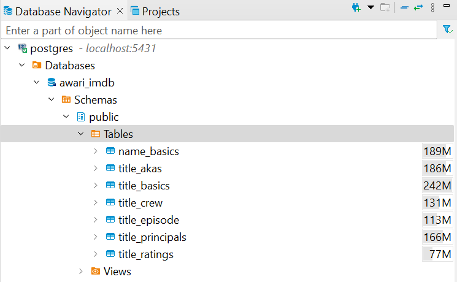
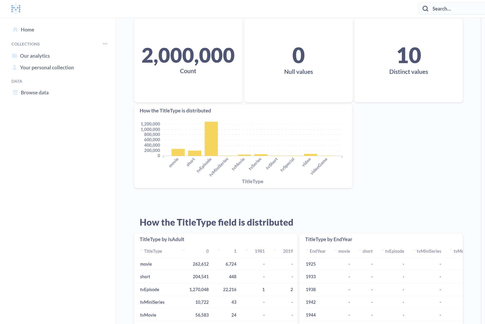

# Documentação do Projeto de Engenharia de Dados - IMDB

---

## 1. Introdução

O projeto tem como propósito disponibilizar dados de filmes da plataforma IMDB para cientistas de dados e analistas de negócios. Ele é construído com um fluxo automatizado que engloba coleta, armazenamento, transformação e visualização dos dados.

### 1.1 Objetivos

- Atualizar o datalake diariamente em consonância com a frequência de atualização da IMDB.
- Preservar um histórico dos dados originais.
- Alocar informações em um banco de dados PostgreSQL para visualização no Metabase.
- Salvar informações em formato parquet no MinIO para consulta por cientistas de dados.

---

## 2. Arquitetura do Projeto

Apresentamos uma visão geral das tecnologias empregadas e de como elas estão integradas no ecossistema.

**Tecnologias Utilizadas:**

- Python
- Airflow
- MinIO
- PostgreSQL
- Metabase
- Docker

---

## 3. Fluxo de Trabalho no Airflow (DAGs)

### 3.1 Coleta e armazenamento de Dados

O Airflow orquestra a coleta diária dos datasets da plataforma IMDB (https://datasets.imdbws.com/), englobando arquivos como `name.basics.tsv.gz`, `title.basics.tsv.gz`, entre outros.

### 3.2 Armazenamento no MinIO

Após a coleta, os arquivos são armazenados no bucket do MinIO no diretório "downloaded", garantindo a preservação do formato original para futuras validações.

### 3.3 Processamento e Transformação

Os dados coletados passam por etapas de extração e transformação:

- Conversão para o formato CSV e armazenamento no diretório "datalake" do MinIO.
  

  
- Posterior processamento para o formato Parquet, armazenados sob "datascience" no MinIO.
  

### 3.4 Carga no PostgreSQL

Os dados do diretório "datalake" são extraídos e transferidos para tabelas no PostgreSQL, tornando-os prontos para análises estruturadas.

 

### 3.5 Visualização no Metabase

Para uma visão ampla dos dados armazenados no PostgreSQL, utilizamos o Metabase, uma plataforma que permite a criação de dashboards personalizados.

---

## 4. Docker e Implantação

Utilizamos o Docker, uma ferramenta de conteinerização, para encapsular e gerenciar os serviços do projeto. Isso garante um ambiente consistente e padronizado desde o desenvolvimento até a produção. O `docker-compose.yml` centraliza a configuração necessária para inicializar os serviços.

**Serviços Configurados:**

- **MinIO:** Quatro instâncias formando um cluster de armazenamento distribuído.
- **Nginx:** Atua como reverse proxy para o MinIO, garantindo balanceamento eficaz.
- **Apache Airflow:** Responsável pela orquestração dos fluxos de trabalho.
- **PostgreSQL:** Dois serviços separados - um para o Airflow e outro para armazenar dados do IMDB.
- **Metabase:** Plataforma de visualização conectada ao PostgreSQL.

Para iniciar o ecossistema, basta executar o comando `docker compose -f ./docker-compose/docker-compose.yml up` na raiz do projeto.

---

## 5. Considerações Finais

Este projeto proporciona um ambiente robusto para a manipulação e análise de dados da plataforma IMDB. Com processos bem definidos e automatizados, asseguramos que os dados estejam sempre atualizados, beneficiando tanto as equipes de ciência de dados quanto analistas de negócios.
